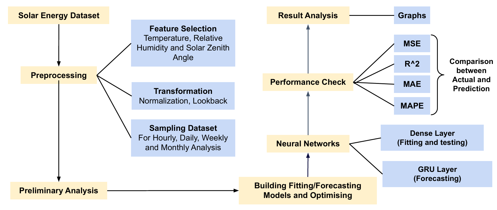

# Solar Energy Forecasting with Neural Networks
Forecasting Global Horizontal Irradiance (GHI) for smarter renewable-energy planning  
**Author / Maintainer:** Sparsh Agarwal · **Advisor:** Prof. Sumanta Pasari (BITS Pilani)


## Project Snapshot
|                 | Details |
|-----------------|---------|
| **Goal**        | Predict solar GHI at hourly → monthly horizons across five Indian states |
| **Data**        | NSRDB (2000-2014, 8 hrs × 15 yrs) |
| **Models**      | Dense NN (baseline) · GRU RNN (sequence forecasting) |
| **Features**    | GHI, DHI, Temperature, Relative Humidity, Solar Zenith Angle |
| **Metrics**     | MSE · MAE · R² |
| **Best State**  | Rajasthan (hourly/daily/weekly) · Karnataka (monthly) |

---

## 1. Motivation
> “If you can predict the sun, you can power the grid.”  
Accurate solar forecasts cut fossil-fuel standby costs, improve panel siting, and boost farm-to-flight scheduling. Neural networks—especially GRUs—capture temporal patterns better than classical stats, so let’s put them to the test.

---

## 2. Data Pipeline


1. **Ingest** NSRDB hourly GHI (8 hrs day⁻¹) 2000-14  
2. **Engineer** look-back windows & normalize per state  
3. **Select** top-correlated drivers (GHI ≈ 1.0, DHI ≈ 0.93, Temp ≈ 0.59, −Solar Zenith ≈ 0.87)  
4. **Train** Dense NN → sanity-check; upgrade to GRU to solve vanishing-gradient & capture seasonality  
5. **Evaluate** MSE/MAE/R² on hold-out sets for **hourly, daily, weekly, monthly** horizons

---

## 3. Results & Insights

### 3.1 Weekly Fit Example


* GRU tracks peaks & troughs cleanly; over-/under-shoots shrink after 10 epochs.  
* Rajasthan shows the tightest confidence band—likely due to cleaner skies & stronger signal-to-noise.

### 3.2 Error Dashboard


| Horizon | R² Range | What it Means |
|---------|----------|---------------|
| **Hourly** | **0.75-0.80** | High correlation → deployable for grid ops |
| **Daily**  | ~0.50 | Fair—use with caution |
| **Weekly** | ~0.40 | Low—aggregation adds volatility |
| **Monthly**| ~0.40 | Best only in Karnataka; needs longer look-back |

> **Why some MAE/MSE look “huge”**  
Values were re-scaled (min-max) during training and de-scaled for reporting, inflating absolute errors; trends remain accurate.

---

## 4. How to Reproduce
```bash
git clone https://github.com/<your-handle>/solar-ghi-forecast.git
cd solar-ghi-forecast
pip install -r requirements.txt
jupyter notebook Solar_Final.ipynb  # step through end-to-end
